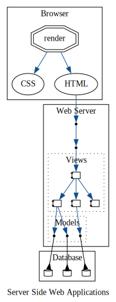
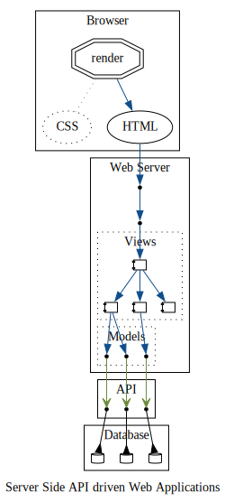
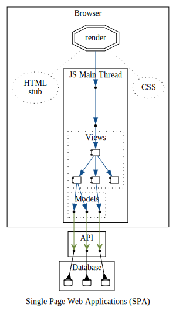
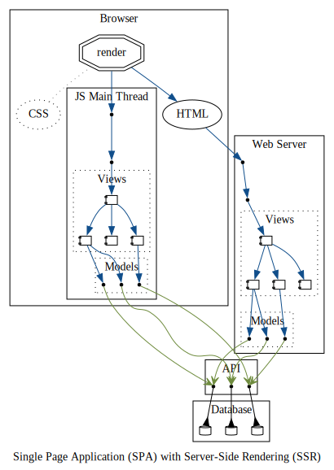
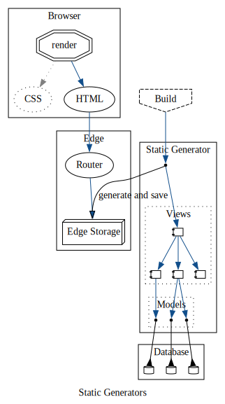
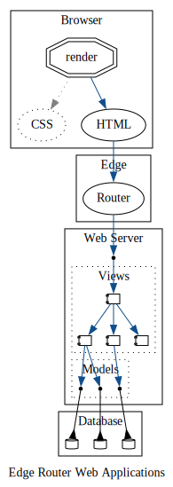

# Topologies

Here are a few example of traditional topologies used in web applications today

- [Server Side](#server-side)
  - [Server Side Web Applications](#server-side-web-applications)
  - [Server Side API driven Web Applications](#server-side-api-driven-web-applications)
- [Single Page Applications](#single-page-applications)
  - [Client-side only Single Page Applications (SPA)](#client-side-only-single-page-applications-spa)
  - [Single Page Applications (SPA) with Server-Side Rendering (SSR)](#single-page-applications-spa-with-server-side-rendering-ssr)
- [Static Generators](#static-generators)
- [Edge Router](#edge-router)

## Server Side

### Server Side Web Applications

### Server Side API driven Web Applications

## Single Page Applications

### Client-side only Single Page Applications (SPA)

### Single Page Applications (SPA) with Server-Side Rendering (SSR)

## Static Generators

## Edge Router

